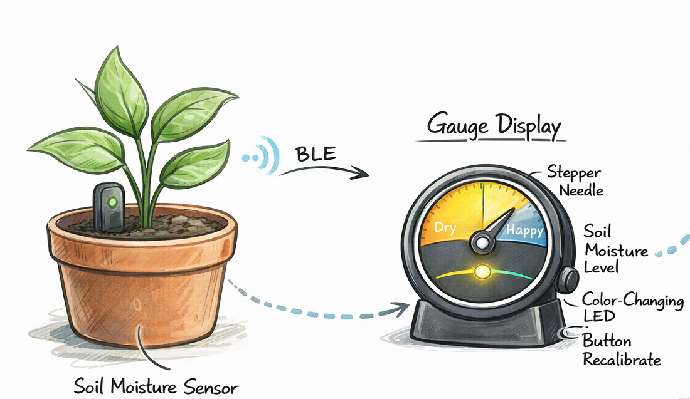
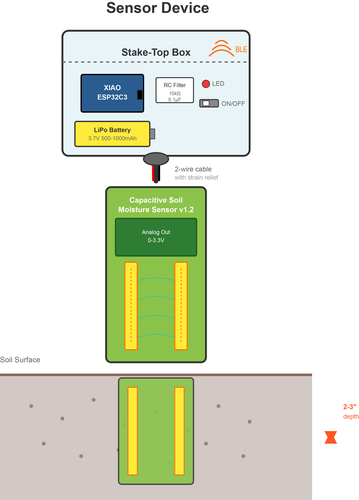
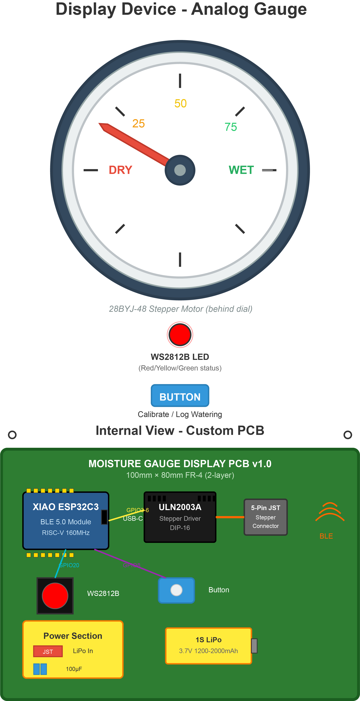
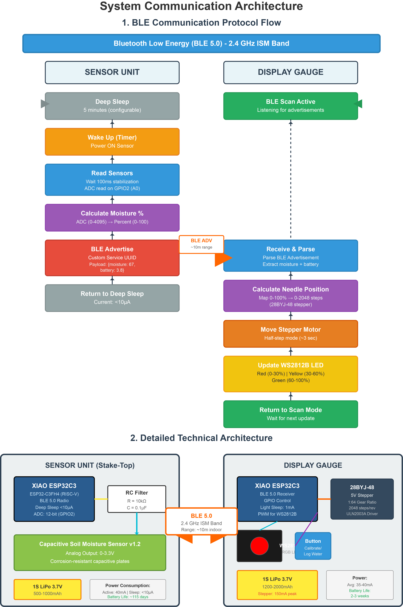

# Techin-514-Final-Project

# Plant Watering Detection
This is a two-device system that helps plant owners understand soil moisture.  
A soil sensor sends moisture estimates over BLE to a stepper-driven gauge that gently indicates **Dry → Okay → Overwatered**, with a soft LED and a calibration button.

## 1) Overall Concept 
**What it does:** This system measures soil moisture in a plant pot and displays the reading on a physical analog gauge with a stepper motor needle and color-changing LED. The sensor unit wirelessly transmits moisture data via Bluetooth Low Energy (BLE) to the display gauge, which shows soil wetness on a traditional meter-style dial.

**Physical Features:**
 The system consists of two battery-powered devices: (1) a compact sensor unit with a stake-style enclosure that sits at the soil surface with the moisture probe inserted into the soil, and (2) a desktop analog gauge featuring a rotating needle (driven by stepper motor), RGB LED indicator, and calibration button housed in a circular meter-style enclosure with a custom PCB.

## 2) Sensor Device
**Device:** Soil Sensor (in/near the plant pot)

**How it works:**
- A capacitive soil moisture probe outputs an analog voltage correlated with moisture.
- The ESP32-C3 samples the analog value, applies smoothing (moving average / EMA), converts it into a normalized `moisture_score (0–100)`, and transmits it over BLE at a low duty cycle to save power.

**Components:**
- Seeed Studio XIAO ESP32C3
- Capacitive Soil Moisture Sensor v1.2: Corrosion-resistant analog sensor (0-3.3V output proportional to moisture)
- RC Low-Pass Filter: 10kΩ resistor + 0.1µF capacitor for analog signal smoothing (cutoff ~159 Hz)
- 1S LiPo Battery: 3.7V 500-1000mAh lithium polymer with JST connector
- SPST Power Switch: Slide or toggle switch for ON/OFF
- Power LED: 3mm red LED with 1kΩ resistor
- Enclosure: 3D-printed stake-top box with cable gland for sensor wire

## 3) Display Device
**Device:** Gauge Display Node (physical needle + LED + button)

**How it works:**
- The display receives `moisture_score` via BLE and maps it to a needle angle (e.g., 0–180°) with hysteresis to prevent jitter.
- One button triggers calibration and/or logs watering; one LED provides a cue.

**Components:**
- Seeed Studio XIAO ESP32C3 (Part: 102010388): Same MCU as sensor unit, acts as BLE receiver
- 28BYJ-48 5V Stepper Motor (Part: 28BYJ-48): Geared stepper motor with 1:64 reduction ratio, ~2048 steps per revolution, includes needle attachment
- ULN2003A Darlington Array (Part: ULN2003A, DIP-16 or SOT23): Stepper motor driver IC, typically on pre-made driver board
- WS2812B RGB LED (Part: WS2812B, 5050 package): Individually addressable smart LED with integrated driver
- Tactile Switch (Part: Generic 6×6mm momentary): Calibration/logging button with internal or external pull-up
- 1S LiPo Battery: 3.7V 1200-2000mAh to handle stepper motor current draw (~150mA when moving)
- Custom PCB: Two-layer FR-4 board integrating all components with mounting holes for stepper motor

**Custom PCB plan:**
- A custom PCB will be designed for the display node integrating MCU headers, ULN2003A stepper driver, WS2812B LED, button, and power connectors.

## 4) Communication + System Diagram

## Parts List with Part Numbers

### Sensor Unit Components

| Component | Part Number / Description | Qty | Notes |
|-----------|---------------------------|-----|-------|
| Microcontroller | Seeed Studio XIAO ESP32C3 (SKU: 102010388) | 1 | ESP32-C3FH4 chip, BLE 5.0, WiFi |
| Soil Sensor | Capacitive Soil Moisture Sensor v1.2 | 1 | Analog output, corrosion-resistant |
| Resistor | 10kΩ ±5% 1/4W carbon film | 1 | RC filter component |
| Capacitor | 0.1µF (100nF) ceramic 50V | 1 | RC filter component |
| Power LED | 3mm Red LED (2V, 20mA) | 1 | Optional status indicator |
| LED Resistor | 1kΩ ±5% 1/4W | 1 | Current limiting for power LED |
| Battery | 1S LiPo 3.7V 500-1000mAh with JST connector | 1 | E.g., Adafruit #328 or similar |
| Switch | SPST slide or toggle switch | 1 | ON/OFF power control |
| Wire | 22AWG stranded 2-conductor cable | 1m | Sensor to board connection |
| Enclosure | 3D printed stake box 60×40×25mm | 1 | STL file provided in repo |
| Cable Gland | PG7 or M12 strain relief fitting | 1 | Waterproof cable entry |

---

### Display Unit Components

| Component | Part Number / Description | Qty | Notes |
|-----------|---------------------------|-----|-------|
| Microcontroller | Seeed Studio XIAO ESP32C3 (SKU: 102010388) | 1 | Same as sensor unit |
| Stepper Motor | 28BYJ-48 5V stepper with gear reduction | 1 | 1:64 ratio, ~2048 steps/rev |
| Stepper Driver | ULN2003A DIP-16 IC | 1 | Or pre-made ULN2003 driver board |
| RGB LED | WS2812B 5050 package (NeoPixel) | 1 | Individually addressable |
| Button | 6×6mm tactile switch, momentary | 1 | Through-hole or SMD |
| Battery | 1S LiPo 3.7V 1200-2000mAh JST | 1 | Higher capacity for stepper |
| Custom PCB | FR-4 2-layer 100×80mm | 1 | Design files in repo |
| Resistor (LED) | 470Ω ±5% 1/4W | 1 | If needed for WS2812B data line |
| Resistor (Button) | 10kΩ ±5% 1/4W | 1 | External pull-up if not using internal |
| Capacitor (Bypass) | 100µF electrolytic 16V | 1 | Power supply smoothing for stepper |
| Capacitor (Decoupling) | 0.1µF ceramic 50V | 3 | Per IC/module |
| Pin Headers | 2.54mm female socket (for XIAO) | 2 | 7-pin each side |
| Connector | 5-pin JST XH or equiv (stepper) | 1 | To 28BYJ-48 |
| Enclosure | Circular meter housing 120mm dia | 1 | 3D printed or modified analog meter |
| Dial Face | Printed paper/plastic 100mm | 1 | Moisture scale 0-100% |
| Needle | 3D printed or metal pointer | 1 | Attaches to stepper shaft |

---

### Common Components & Tools

| Item | Description | Qty | Notes |
|------|-------------|-----|-------|
| Breadboard wires | Male-to-male/female jumper wires | 1 set | For prototyping |
| Heat shrink tubing | Assorted sizes 2-6mm | 1 set | Wire insulation |
| M2 screws | M2×6mm screws | 4 | PCB mounting |
| M3 screws | M3×10mm screws | 2 | Stepper motor mounting |
| JST connectors | 2-pin JST connectors for batteries | 2 | Power connections |
| USB-C cable | USB-C to USB-A programming cable | 1 | For XIAO programming |
